# Guruprasath Annadurai

Python and data engineer moving into AI platform work. I build infrastructure that decides what AI agents are allowed to do, and records that it did.

Bengaluru, India · Open to relocation · Available immediately · [annaduraiguruprasath8@gmail.com](mailto:annaduraiguruprasath8@gmail.com) · [Portfolio](https://guruprasath-annadurai.github.io/Guruprasath-Annadurai/)

**Looking for:** AI Platform Engineer, Agentic AI Engineer, Backend AI Engineer roles.

## Projects

**[WhitePact](https://github.com/Guruprasath-Annadurai/Whitepact)** · May 2026 – present · open source
Deterministic, LLM-free authorization for AI agent actions. Each action gets one of five outcomes (allow, allow with redaction, require approval, deny, quarantine), with human approval through LangGraph and a hash-chained audit log.
- Integrations: MCP server, LangChain, Google ADK
- Platform: PostgreSQL, Redis rate limiting, RBAC, TOTP MFA, OpenTelemetry
- About 5,000 tests, 87% coverage. On PyPI as [`rai-governance-platform`](https://pypi.org/project/rai-governance-platform/) (1,800+ downloads)

**Orneur** · Jun 2026 – present · alpha
Self-hosted AI platform on Ollama: answers with citations, prompt-injection filtering, a cost router with a daily spend cap, an MCP server, and fine-tuning and evaluation tooling.

**Edora** · Jun – Aug 2026
AI tutoring app using RAG over pgvector, on PostgreSQL with Supabase row-level security.

## Experience

**Software Engineer II, Techezz Infos** · Jun 2023 – Aug 2024
- Python and PySpark pipelines on AWS Glue for regulated capital-markets data, 20M+ records a day
- Data lineage and regulatory-reporting controls
- Django and Flask services; Databricks and Delta Lake; Terraform and CI/CD

**Data Engineering Intern, HCL Technologies** · Oct 2022 – Mar 2023

## Education

- MBA (General), Middlesex University London
- B.Tech, Computer Science and Engineering, ISBM University, Chhattisgarh

## Stack

Python · PySpark · Django/Flask · PostgreSQL · pgvector · Redis · AWS Glue · Databricks · Delta Lake · Terraform · LangChain · LangGraph · Google ADK · MCP · Ollama · OpenTelemetry

Activity

